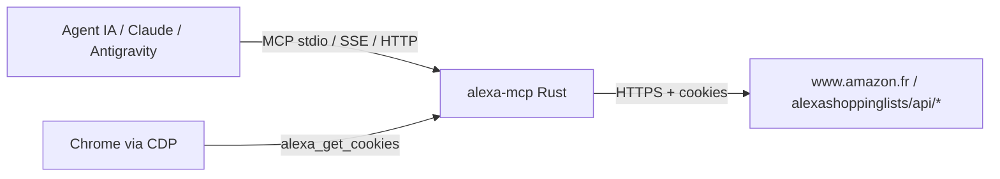

# Alexa Shopping List MCP (`alexa-mcp`)

Serveur **MCP (Model Context Protocol)** en **Rust** pour **lire et gérer la
liste de courses Amazon Alexa**. Inspiré de l'architecture de
`leclerc-mcp` : configuration par variables d'environnement, cookies
embarqués ou injectés, outils MCP, serveur HTTP/SSE, export des cookies via
navigateur CDP, image Docker et pipeline CI.

L'API utilisée est celle de l'application mobile Alexa (reverse-engineerée par
le projet `TheSethRose/Alexa-Shopping-List`, MIT) : le serveur envoie les
requêtes avec le couple de cookies de session Amazon et l'User-Agent de l'app
iPhone Alexa.



---

## Outils MCP exposés

| Nom de l'outil | Description |
| :--- | :--- |
| `alexa_get_shopping_list` | **Lit la liste de courses** (tous / actifs / terminés) : id, libellé, état + compteurs. |
| `alexa_add_item` | Ajoute un ou plusieurs articles à la liste. |
| `alexa_complete_item` | Marque un article comme terminé (ou le réouvre). |
| `alexa_delete_item` | Supprime un article. |
| `alexa_get_cookies` | Lit les cookies Amazon de la session navigateur et les exporte. |

---

## API Alexa utilisée

Base : `AMAZON_URL` (par défaut `https://www.amazon.fr`).

| Action | Requête |
| :--- | :--- |
| Lire la liste | `GET /alexashoppinglists/api/getlistitems` |
| Ajouter | `POST /alexashoppinglists/api/addlistitem/{base64(listId)}` — corps `{"value":"...","type":"TASK"}` |
| Terminer / réouvrir | `PUT /alexashoppinglists/api/updatelistitem` — l'article complet avec `completed` modifié |
| Supprimer | `DELETE /alexashoppinglists/api/deletelistitem` — l'article complet |

La réponse de `getlistitems` est un objet indexé par l'id de liste :
`{"amzn1.account....-SHOPPING_ITEM": {"listItems": [...]}}`. L'id de liste
est extrait de cette clé (surchargeable avec `ALEXA_LIST_ID`).

Headers envoyés : User-Agent iPhone Alexa, `Accept: */*`,
`DNT: 1`, `Upgrade-Insecure-Requests: 1`, plus le header
`Cookie` construit depuis les cookies configurés.

---

## Cookies Amazon

Un compte Amazon exige une session authentifiée. Trois sources, par ordre de
priorité :

1.  `ALEXA_COOKIES_JSON` — tableau JSON en variable d'environnement.
2.  `ALEXA_COOKIES_FILE` — chemin d'un fichier JSON.
3.  les cookies embarqués dans `config/alexa-cookies.json` (vide par défaut).

### Obtenir les cookies

*   **Via le navigateur piloté** : connectez-vous à Amazon dans le Chrome piloté
    par le serveur (browserless, ou Chrome local en mode `launch`), puis
    appelez l'outil `alexa_get_cookies` (ou
    `GET /api/alexa/cookies?save=true`). Les cookies sont écrits dans
    `~/.alexa-mcp/alexa-cookies.json`.
*   **Via une extension navigateur** (Cookie-Editor / EditThisCookie) : exportez
    les cookies de `amazon.fr` et collez-les dans
    `ALEXA_COOKIES_JSON` ou dans `config/alexa-cookies.json`.

> Les sessions Amazon expirent : si vous recevez une erreur HTTP 401/403,
> rafraîchissez les cookies.

---

## Configuration

| Variable | Défaut | Description |
| :--- | :--- | :--- |
| `BIND_ADDR` | `0.0.0.0:8080` | Adresse d'écoute HTTP/MCP. |
| `AMAZON_URL` | `https://www.amazon.fr` | Boutique Amazon (changez le TLD selon votre compte). |
| `ALEXA_LIST_ID` | auto | Id de liste forcé (sinon découvert via `getlistitems`). |
| `ALEXA_COOKIES_JSON` | — | Cookies de session (JSON). |
| `ALEXA_COOKIES_FILE` | — | Fichier de cookies (JSON). |
| `ALEXA_COOKIES_OUTPUT` | `~/.alexa-mcp/alexa-cookies.json` | Destination de `alexa_get_cookies`. |
| `ALEXA_BROWSER_MODE` | `connect` | `connect` (browserless) ou `launch` (Chrome local). |
| `BROWSERLESS_WS_URL` | `ws://browserless-chrome...:3000` | Endpoint CDP (mode connect). |
| `BROWSERLESS_TOKEN` | — | Token browserless optionnel. |
| `ALEXA_CHROME_PATH` | auto | Binaire Chrome (mode launch). |
| `ALEXA_CHROME_PROFILE_DIR` | `~/.alexa-mcp/chrome` | Profil Chrome persistant. |
| `ALEXA_HEADLESS` | `false` | Chrome headless (mode launch). |
| `ALEXA_CONFIG_DIR` | `~/.alexa-mcp` | Répertoire d'état. |
| `ALEXA_MIN_INTERVAL_MS` | `1000` | Délai minimal entre requêtes. |
| `ALEXA_JITTER_MS` | `400` | Jitter aléatoire. |
| `ALEXA_MAX_RETRIES` | `3` | Retries sur 429/503. |
| `ALEXA_BACKOFF_BASE_MS` | `1500` | Backoff de base. |
| `MCP_TRANSPORT` | — | `stdio` pour le transport stdin/stdout. |
| `RUST_LOG` | `alexa_mcp=info,tower_http=info` | Filtre de logs. |

---

## Développement local

```powershell
./local-c.ps1                 # fmt + check + clippy + tests
./local-c.ps1 -Release        # + cargo build --release
./local-c.ps1 -Docker         # + docker build -t alexa-mcp:local .
```

Lancement :

```bash
export AMAZON_URL="https://www.amazon.fr"
export ALEXA_COOKIES_JSON='[{"name":"session-id","value":"...","domain":".amazon.fr","path":"/"}]'
cargo run
```

Transport stdio (client MCP qui lance le process) :

```bash
cargo run -- --stdio
```

---

## Endpoints HTTP

| Chemin | Méthode | Description |
| :--- | :--- | :--- |
| `/health`, `/ready` | GET | Healthcheck. |
| `/sse` | GET | Flux SSE MCP. |
| `/message` | POST | Requête JSON-RPC MCP. |
| `/api/alexa/items?status=active` | GET | Liste de courses. |
| `/api/alexa/items/add` | POST | Ajout (`item` ou `items`). |
| `/api/alexa/items/complete` | POST | `item`, `completed`. |
| `/api/alexa/items/delete` | POST | `item`. |
| `/api/alexa/cookies` | GET | Export des cookies (`?save=false` pour ne pas écrire). |

---

## Container et CI

```bash
docker build -t ghcr.io/jzacharie/alexa-mcp:latest .
docker pull ghcr.io/jzacharie/alexa-mcp:latest
```

Le workflow `.github/workflows/docker.yml` compile et publie l'image sur
**GitHub Container Registry** (`ghcr.io/jzacharie/alexa-mcp`) sur
`main`, les tags `v*` et manuellement.

Chart Helm de référence : `deploy/helm/alexa-mcp`.

---

## Remerciements

L'API Alexa (endpoints `alexashoppinglists`, en-têtes de l'app mobile) a
été documentée par le projet open-source
`TheSethRose/Alexa-Shopping-List` (MIT). L'architecture du serveur
s'inspire de `leclerc-mcp`.
